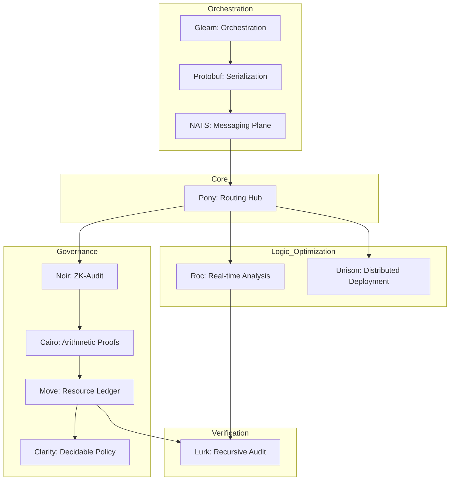

# LAGOS: Latency-aware Accountable Governance for Overlay Scaling

**LAGOS** is a novel research framework designed to address the tripartite challenge of accountability, scaling, and latency in distributed overlay networks. It adopts an innovative **polyglot architecture** leveraging nine modern programming languages to maximize safety, performance, and cryptographic governance.

## Key Research Pillars

LAGOS is built upon six critical research pillars:

1.  **Enterprise Blockchain Scaling**: Governance across multiple administrative domains.
2.  **Tail-Latency Minimization**: Applying data center strategies to wide-area overlay networks.
3.  **P2P-driven Last-Mile Optimization**: Reducing latency at the network edge.
4.  **Internet-scale DDoS Mitigation**: High-speed traffic analysis and filtering.
5.  **MultiPath TCP (MPTCP) Evaluation**: Leveraging path redundancy for throughput and reliability.
6.  **Federated SDN Orchestration**: Decentralized control plane management.

## Polyglot Architecture

LAGOS decomposes networking and governance logic into specialized modules, each implemented in the language best suited for its specific requirements.



### Language Stack & Roles

LAGOS represents a unique integration of nine specialized programming languages:

| Language | Role | Rationale |
| :--- | :--- | :--- |
| **Pony** | Core Routing | Actor model with reference capabilities for race-free high-speed execution. |
| **Gleam** | Orchestration | Scalable, fault-tolerant distributed logic on the BEAM VM. |
| **Move** | Governance | Resource-oriented paradigm for safe management of overlay assets. |
| **Clarity** | Policy | Decidable smart contracts for predictable governance outcomes. |
| **Noir** | ZK-Audit | ZK-SNARK DSL for generating accountability proofs. |
| **Cairo** | Proofs | CPU-like STARK-provable programs for complex arithmetic. |
| **Lurk** | Verification | Recursive SNARKs for provable evaluation of complex governance rules. |
| **Roc** | Optimization | Purely functional language compiling to machine code for time-critical ops. |
| **Unison** | Deployment | Content-addressed functions for seamless distributed logic updates. |

## Repository Structure

- `core/`: Primary execution logic (Pony, Gleam).
- `contracts/`: Smart contracts for governance (Move, Clarity).
- `proofs/`: Zero-knowledge proof circuits (Noir, Cairo, Lurk).
- `logic/`: Optimization algorithms and MPTCP logic (Roc).
- `fns/`: Content-addressed function primitives (Unison).
- `deploy/`: MPTCP testbed and orchestration scripts.
- `_paper/`: LaTeX source for the research manuscript.

## Getting Started

### Automated Setup

For a quick setup of all nine specialized toolchains and their dependencies on Linux, run the provided setup script:

```bash
chmod +x setup.sh
./setup.sh
```

After the script completes, restart your terminal or source your shell profile (e.g., `source ~/.bashrc`) to update your environment variables.

### Manual Prerequisites

- [Ponyup](https://github.com/ponylang/ponyup) (Pony & Corral)
- [Gleam](https://gleam.run/getting-started/)
- [Sui CLI](https://docs.sui.io/guides/developer/getting-started/sui-install) (Move)
- [Clarinet](https://github.com/hirosystems/clarinet) (Clarity)
- [Nargo](https://noir-lang.org/getting_started/nargo_installation) (Noir)

